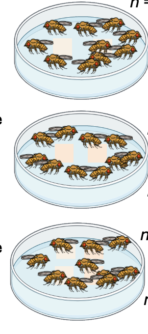

# The Effects of the Social Environment and Microbe Deposition on Dietary Choice in *Drosophila melanogaster*

A GitHub Repository for my Masters of Science by Research project at the University of East Anglia. 

## 🗂 Scripts 📜

### 🗂️ Chapter 2 -  dietary-choice: Effects of a Conditioned Diet on Dietary Choice: 

### data_visualisation_feeding.R    
This script includes visualisation for the preferred feeding diet for a mated female when allowed to choose across different diets that have been conditioned or unconditioned. There are boxplots which show experimental repeats which have been combined, and plots for separate blocks. 
### data_analysis_feeding.R    
This script includes data analysis for the feeding assays. 
In this analysis `glmer()` and `glmmTB()` models were used.

### data_visualisation_oviposition.R 
This script includes visualisation for the preferred oviposition diet for a mated female when allowed to choose across different diets that have been conditioned or unconditioned. There are boxplots which show experimental repeats which have been combined, and plots for separate blocks. 

### data_analysis_oviposition.R    
This script includes data analysis for the oviposition assays. 
In this analysis `glmer()` and `glmmTB()` models were used.

   

### 🗂️Chapter 3 -  dietary-fitness: Effects of a Conditioned Diet on Fly Fitness:

### 🗂 uncontrolled_density

  ## 🗂 overall_emergence 

  ## 🗂 development_time

  ## 🗂 data_visualisation

  ## 🗂 body_weight 

### 🗂 controlled_density

  ### 🗂 overall_emergence 

  ### 🗂 development_time

  ### 🗂 data_visualisation

  ### 🗂 body_weight 

### 🗂️ density-conditioning: Effects of Conditoning Density on Dietary Choice:

### density_feeding.R   

A script for visualising and analysing the data of the denisty feeding experiments. 

### 🗂️power-analysis: Using previous data to check power of future experiments.

### poweranalysis-densityexperiment.R

A simulation which allows one to see if the dietary assays will have enough power for the density conditioning dietary choice experiment.

### poweranalysis-microbialwash.R

A simulation which allows one to see if the dietary assays will have enough power for the microbial wash dietary choice experiment.

